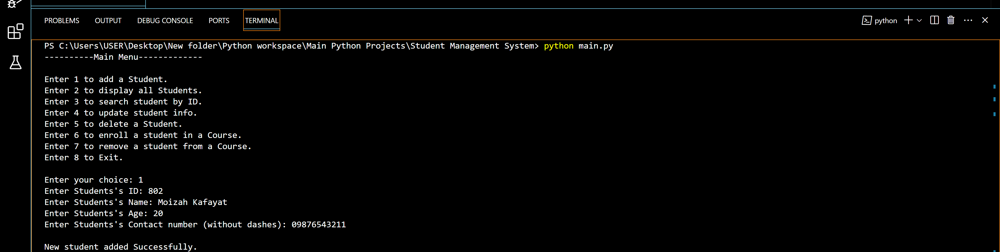
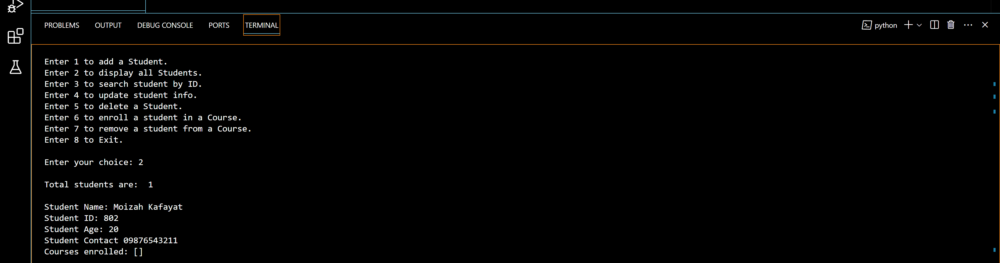
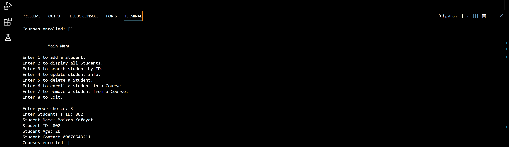
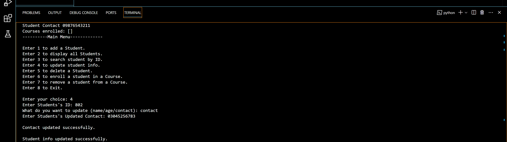
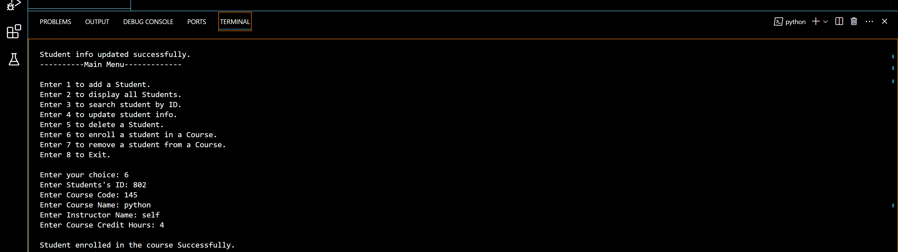

# 🎓 Python Project: Student Management System  
### Console-Based OOP Project

---

## 🔍 Project Overview

Welcome to my **Student Management System**, a console-based Python project developed as part of my **Python-Learning Journey**. 🌱

The goal of this project was to strengthen my Python fundamentals by building something meaningful from scratch. This system allows for **efficient student and course management**, including adding, updating, searching, deleting records, all while storing data persistently using JSON.

This project helped me dive deep into **Object-Oriented Programming**, **file handling**, **modular coding**, and **practical logic-building** , essential skills for anyone aspiring to work in tech or data.

---

## ✨ Key Features

- ✅ Add New Students (name, roll no, contact, etc.)
- ✅ View All Student Records
- ✅ Search Students by ID
- ✅ Update or Delete Existing Students
- ✅ Enroll/Remove Students in/from Courses
- ✅ Persistent Data Storage via JSON
- ✅ Input Validation and User-Friendly Menu Interface

---


## 🧠 What I Learned

- 💡 Object-Oriented Programming (Classes, Composition, Custom Methods)
- 💾 File Handling with JSON: Save/load structured data persistently
- 🔁 Data Conversion: Serializing and deserializing nested objects
- 🧪 Debugging: Solved issues like type errors, missing keys, object conversion
- 🔍 Modular Programming: Code split across clean and logical files
- ✅ Error Handling: Input validation and safe file loading

---

## 🧪 Demo Snapshots

### Main Menu and Adding a new Student

*A quick look at the interactive menu and adding a new student.*


### Displaying all students

*DisplayinG all students in a proper format.*

### Search specific student using ID

*Searching student using Student ID and displaying that student info.*

### Updating student info using ID

*Updating student info (name/age/contact) using Student ID*

### Course Enrollment

*Enrolling student in a course.*

### Saving all updaed  data and exiting the program

*Saving modified/updated list of students into students.json*

---

## 🛠️ Technologies Used

- Python 3 or above
- JSON Module (for data storage)
- OOP principles (classes, methods, logic)

---

## 🚀 How to Run the Project

### 🧱 Prerequisites

- Python 3 installed on your machine  
- Basic terminal/command prompt usage

### 📥 Steps

```bash
# 1. Clone the repository
git clone https://github.com/MoizaA17/Student-ManagementSystem.git

# 2. Navigate into the folder
cd Student-ManagementSystem

# 3. Run the app
python main.py


## Author 👩‍💻

* **MoizaA17** - Connect with me on [GitHub](https://github.com/MoizaA17)!

